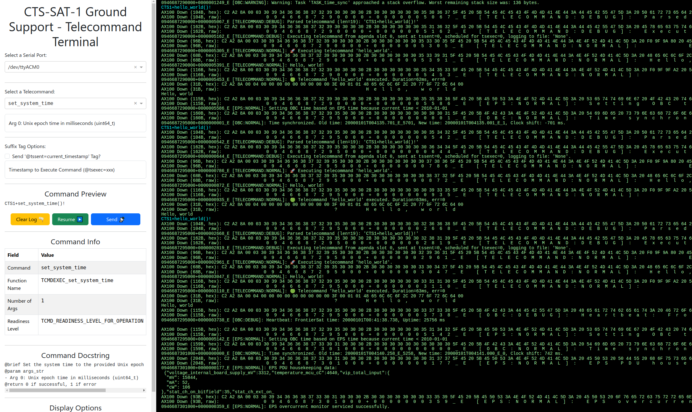

# CTS-SAT-1-Ground-Support Software (`cts1_ground_support`)

Python-based Ground Support software for the CTS-SAT-1 (FrontierSat) 3U CubeSat mission.

This ground support software is used to test the satellite by sending the satellite telecommands,
primarily over the debug UART interface. It is a command-aware UART terminal.

Over time, the goal is to develop it into the ground station control software.

## Goals

1. Increase ease of testing during development.
2. Enable automated testing via telecommands to rapidly test for regressions during development.

## Features

* Python-based.
* Serial communication with the OBC (Onboard Computer), which runs the firmware in this repo.
* Automatically parses the C code and loads the list of telecommands, along with certain associated metadata (including documentation), from this git repo.
* Executes automated test procedures by executing telecommands, and assessing the response(s).

## Getting Started

### Steps to Install

1. Install the `uv` package manager: https://docs.astral.sh/uv/getting-started/installation/
2. Run `uv tool install git+https://github.com/CalgaryToSpace/CTS-SAT-1-Ground-Support`
3. Run `cts1_ground_support --help` to ensure it installed.
4. Run `cts1_ground_support` to start the ground support terminal.
5. Visit [http://127.0.0.1:8050/](http://127.0.0.1:8050/) in a web browser to view the web interface and send commands to your dev kit.

### Steps for Development

1. Install the `uv` package manager: https://docs.astral.sh/uv/getting-started/installation/
2. Clone the git repository. Open a terminal in the cloned repo's folder.
    * On Windows, take care to clone git repos away from the Documents folder that OneDrive insists on syncing.
2. Run `uv venv` to create a virtual environment at `.venv/`.
3. Run `uv sync --dev` to install the dependencies into the virtual environment.
4. Run `uv run cts1_ground_support --help` to ensure it installed.
5. Run `uv run cts1_ground_support` to start the ground support terminal.
6. Visit [http://127.0.0.1:8050/](http://127.0.0.1:8050/) in a web browser to view the web interface and send commands to your dev kit.

## Developing Telecommands

After following the Getting Started section, you can run the ground support terminal by running `cts1_ground_support`.

If you are adding new telecommands, ensure that `CTS-SAT-1-Ground-Support` and `CTS-SAT-1-OBC-Firmware` are cloned in the same parents directory. Then, run the ground support terminal with this argument:

```bash
# To see new/in-progress telecommands, use the `-r` flag to specify the path to the firmware repo.
cts1_ground_support -r ../CTS-SAT-1-OBC-Firmware
```

## Development

1. Install the project as in the Getting Started section.
2. Run `pip install -e '.[dev]'` to install the development dependencies.
3. Optional: Run `cts1_ground_support --debug` to start the ground support terminal in debug mode.

The ground support terminal will automatically reload when you make changes to the code. It is written using the Dash framework in Python.

## Screenshots


